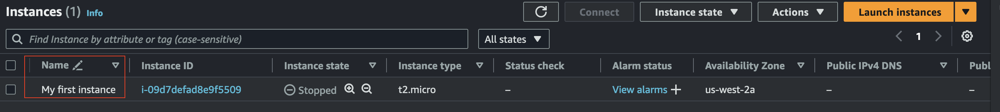

# EC2

## Differences between Terraform terms and AWS UI

| AWS | Terraform |
|---|---|
| `EC2` → `Instances` → `Security` → `Security details` → `IAM Role` | `aws_instance` → `iam_instance_profile` |

## How to set the name of the instance

There is not an actual property for the `aws_instance` resource to set the instance name, instead you can pass the `Name`
attribute to the `tags` attribute.

```tf
resource "aws_instance" "example" {
  ami           = "ami-0c55b159cbfafe1f0"
  instance_type = "t2.micro"
  tags = {
    "Name" = "My first instance"
  }
}
```



## Instance purchasing options

- [On-Demand Instances](ec2-on-demand-instances) – Pay, by the second, for the instances that you launch.
- [Savings Plans](ec2-savings-plans) – Reduce your Amazon EC2 costs by making a commitment to a consistent amount of usage, in USD per hour, for a term of 1 or 3 years. See [FAQ](ec2-savings-plans-faq).
- [Reserved Instances](ec2-reserved-instances) – Reduce your Amazon EC2 costs by making a commitment to a consistent instance configuration, including instance type and Region, for a term of 1 or 3 years.
- [Spot Instances](ec2-spot-instances) – Request unused EC2 instances, which can reduce your Amazon EC2 costs significantly.
- [Dedicated Hosts](ec2-dedicated-hosts) – Pay for a physical host that is fully dedicated to running your instances, and bring your existing per-socket, per-core, or per-VM software licenses to reduce costs.
- [Dedicated Instances](ec2-dedicated-instances) – Pay, by the hour, for instances that run on single-tenant hardware.
- [Capacity Reservations](ec2-capacity-reservations) – Reserve capacity for your EC2 instances in a specific Availability Zone.

See: https://docs.aws.amazon.com/AWSEC2/latest/UserGuide/instance-purchasing-options.html

[ec2-on-demand-instances]: https://docs.aws.amazon.com/AWSEC2/latest/UserGuide/ec2-on-demand-instances.html.html
[ec2-savings-plans]: https://docs.aws.amazon.com/savingsplans/latest/userguide/what-is-savings-plans.html
[ec2-savings-plans-faq]: https://aws.amazon.com/savingsplans/faq/
[ec2-reserved-instances]: https://docs.aws.amazon.com/AWSEC2/latest/UserGuide/ec2-reserved-instances.html
[ec2-spot-instances]: https://docs.aws.amazon.com/AWSEC2/latest/UserGuide/using-spot-instances.html
[ec2-dedicated-hosts]: https://docs.aws.amazon.com/AWSEC2/latest/UserGuide/dedicated-hosts-overview.html
[ec2-dedicated-instances]: https://docs.aws.amazon.com/AWSEC2/latest/UserGuide/dedicated-instance.html
[ec2-capacity-reservations]: https://docs.aws.amazon.com/AWSEC2/latest/UserGuide/capacity-reservation-overview.html
